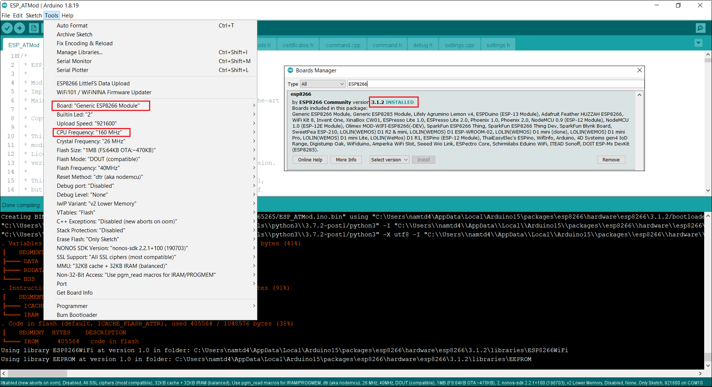

# ESP01 firmware
- Source:
  - [https://github.com/JiriBilek/ESP_ATMod](https://github.com/JiriBilek/ESP_ATMod)

- Modifications:
  - Nâng cấp để chạy với __ESP8266 Arduino Core version 3.1.2__ (version cũ là __2.7.4__)
    - [https://github.com/JiriBilek/ESP_ATMod/issues/23](https://github.com/JiriBilek/ESP_ATMod/issues/23)

  - Thêm file __certificates.h__ để lưu các biến array khai báo key của server và client:
    - [https://github.com/ptitopen-git/D11_TranDucNam/blob/master/Code/ESP01/01_firmware/ESP_ATMod/certificates.h](ESP_ATMod/certificates.h)

  - Thêm bước __setClientRSACert__ cài đặt key của client trước khi thực hiện connect TLS
    - [https://github.com/ptitopen-git/D11_TranDucNam/blob/master/Code/ESP01/01_firmware/ESP_ATMod/command.cpp#L1698](ESP_ATMod/command.cpp#L1698)

  - Đổi lại mode mặc định: TLS authentication mode = 2 (sử dụng Certificate)
    - [https://github.com/ptitopen-git/D11_TranDucNam/blob/master/Code/ESP01/01_firmware/ESP_ATMod/ESP_ATMod.ino#L144](ESP_ATMod/ESP_ATMod.ino#L144)

  - Đổi lại baudrate mặc định cho Serial là `57600` để chạy với thư viện `LbSPISerial`
    - [https://github.com/ptitopen-git/D11_TranDucNam/blob/master/Code/ESP01/01_firmware/ESP_ATMod/ESP_ATMod.ino#L198](ESP_ATMod/ESP_ATMod.ino#L198)

  - Cấu hình `CPU frequency = 160 MHz` khi build firmware
  


- Flash & Ram size:
```
. Variables and constants in RAM (global, static), used 33328 / 80192 bytes (41%)
║   SEGMENT  BYTES    DESCRIPTION
╠══ DATA     1716     initialized variables
╠══ RODATA   3188     constants
╚══ BSS      28424    zeroed variables
. Instruction RAM (IRAM_ATTR, ICACHE_RAM_ATTR), used 60163 / 65536 bytes (91%)
║   SEGMENT  BYTES    DESCRIPTION
╠══ ICACHE   32768    reserved space for flash instruction cache
╚══ IRAM     27395    code in IRAM
. Code in flash (default, ICACHE_FLASH_ATTR), used 405572 / 1048576 bytes (38%)
║   SEGMENT  BYTES    DESCRIPTION
╚══ IROM     405572   code in flash
```
